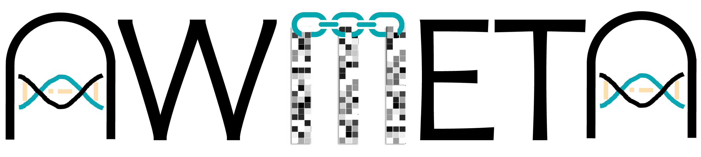
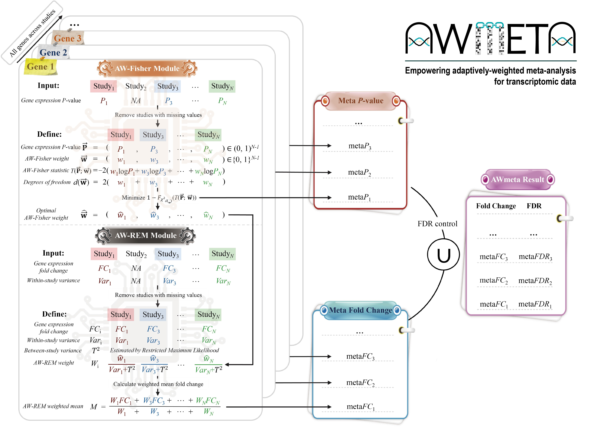

<p align="center">
  
</p>

[](https://github.com/YanshiHu/AWmeta/stargazers)


[](https://www.biorxiv.org/content/10.1101/2025.05.06.650408)
[](https://doi.org/10.1101/2025.05.06.650408)
[](https://opensource.org/licenses/MIT)


## **[<b>AWmeta</b>](https://github.com/YanshiHu/AWmeta) ([<ins><b>A</b></ins>](https://github.com/YanshiHu/AWmeta)daptively-[<ins><b>W</b></ins>](https://github.com/YanshiHu/AWmeta)eighted transcriptomic [<ins><b>meta</b></ins>](https://github.com/YanshiHu/AWmeta)-analysis, [ɔːˈmɛtə])**

<!--
> [!IMPORTANT]
> We will release scripts soon, please stay tuned. :)
-->

<p align="justify">
Transcriptomic meta-analysis enhances biological veracity and reproducibility by integrating diverse studies, yet prevailing <i>P</i>-value or effect-size integration approaches exhibit limited power to resolve subtle signatures. We present AWmeta, an adaptively-weighted framework that unifies both paradigms. Benchmarking across 35 Parkinson's and Crohn's disease datasets spanning diverse tissues and adaptively down-weighting underpowered studies, AWmeta yields higher-fidelity differentially expressed genes (DEGs) with markedly reduced false positives, and establishes superior gene differential quantification convergence at both gene and study levels over state-of-the-art random-effects model (REM) and original studies. AWmeta requires fewer samples and DEGs from original studies to achieve substantial gene differential estimates, lowering experimental costs. We demonstrate AWmeta's remarkable stability and robustness against external and internal perturbations. Crucially, AWmeta prioritizes disease tissue-specific mechanisms with higher functional coherence than those from REM and original studies. By bridging statistical rigor with mechanistic interpretability, AWmeta harmonizes heterogeneous transcriptomic data into actionable insights, serving as a transformative tool for precision transcriptomic integration.
</p>


## 🗺️Overview




## ⚙️Installation

### :one: Download AWmeta repo
Clone this repository and rename to your project name.
```{bash}
git clone https://github.com/YanshiHu/AWmeta.git
mv AWmeta my_project_name
cd my_project_name
```

### :two: Create a conda environment
#### 1. Install Miniforge/Mambaforge:
```sh
wget https://github.com/conda-forge/miniforge/releases/latest/download/Miniforge3-Linux-x86_64.sh
bash Miniforge3-Linux-x86_64.sh
```
> [!TIP]
> **1**. [Miniforge](https://github.com/conda-forge/miniforge) holds the minimal installers for [Conda](https://conda.io/) and [Mamba](https://github.com/mamba-org/mamba) specific to [conda-forge](https://conda-forge.org/).
> 
> **2**. [Mamba](https://github.com/mamba-org/mamba) is a reimplementation of the [Conda](https://conda.io/) package manager in C++, thus much more faster.

#### 2. If several linux files are missing when running the above scripts, use the following code:
```sh
sudo apt install zlib1g-dev libncurses5-dev libbz2-dev liblzma-dev
```

#### 3. Create your own conda environment:
```sh
mamba create -n AWmeta
mamba activate AWmeta
```

### :three: Set up required packages
#### 1. Install R, AWFisher and MetaVolcanoR:
```sh
mamba install conda-forge::r-base==4.1.0
mamba install bioconda::bioconductor-awfisher
mamba install bioconda::bioconductor-metavolcanor
```
#### 2. Install MetaDE directly from GitHub in R console:
```R
install.packages("devtools")
devtools::install_github("metaOmics/MetaDE")
```


## 🛠Usage

#### 1. Load AWmeta method:
```R
source("AWmeta.R")
```
#### 2. Run following command to do adaptively-weighted transcriptomic meta-analysis ([step-by-step tutorial](https://github.com/YanshiHu/AWmeta/blob/main/AWmeta_demo.ipynb)):
```text
AWmeta(raw.data.dir, raw.clin.dir, raw.sep, DE.method, compare.group, ref.level, paired, core.num)

Arguments:
       raw.data.dir		A path to the raw expression data files.
       raw.clin.dir		A path to the clinical/phenotype data files.
       raw.sep			A field separator character. Values on each line of the raw expression
				and clinical/phenotype data file are separated by this character.
       DE.method		A character vector specifying the DE analysis method(s).
				  - Single Method (length 1): e.g., `"limma"`. 
					Applies this method to all studies.
				  - Two Methods (length 2): e.g., `c("limma", "DESeq2")`. 
					Provide one continuous method ("limma", "sam") for microarray
					data and one discrete method ("edgeR", "DESeq2", "limmaVoom")
					for RNA-seq data. The function will auto-detect if a study's
					data is integer-based (discrete) or decimal-based (continuous)
     					and apply the corresponding method.
       compare.group 		A character vector of length 2 specifying the names of the two groups
				to compare in the clinical/phenotype data (e.g., c("control", "PD")).
       ref.level 		A character string specifying which one of the two groups in
				`compare.group` is the reference level (e.g., "control").
       paired 			A logical value (TRUE/FALSE) indicating whether the samples are paired.
       core.num 		An integer specifying the number of CPU cores to use for parallel
				computation.
```


## ✍️Citation

**To cite AWmeta:**

<ins>Yanshi Hu</ins><sup>$</sup>, Zixuan Wang, Yueming Hu, Cong Feng, Qiuyu Fang, Ming Chen<sup>$</sup> (2025). [AWmeta empowers adaptively-weighted transcriptomic meta-analysis](https://doi.org/10.1101/2025.05.06.650408). <i><b>bio<span style="color:#ff0000;">R</span>&chi;iv</b></i>, 2025.05.06.650408.


## 😵Issues

If you have any questions or thoughts, please feel free to  [file an issue](https://github.com/YanshiHu/AWmeta/issues) or direct to yanshihu [at] zju [dot] edu [dot] cn.

